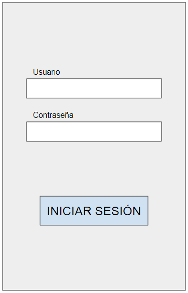
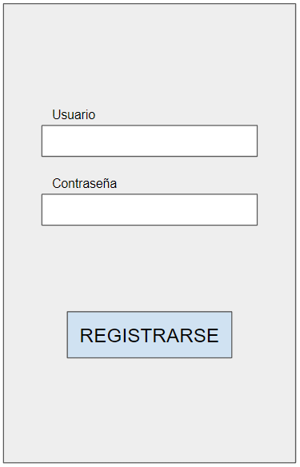
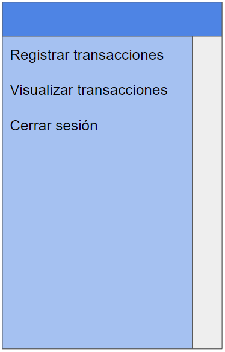
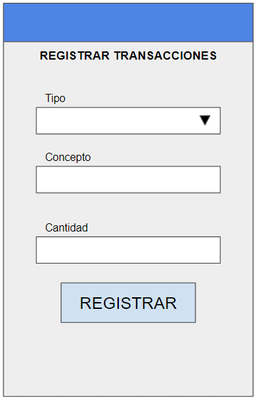
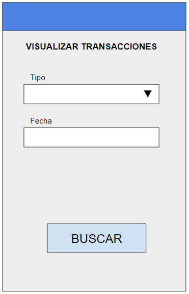
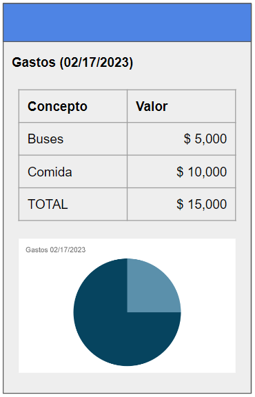

# Diseño de interfaz de usuario

La aplicación tiene una combinación de azul y blanco. Se pueden ver las pantallas de la misma a continuación:

1. Login

   Cuando el usuario ingrese a la aplicaicón verá una pantalla de inicio de sesión que solicitará un usuario y contraseña.

   

2. Registro

   Si el usuario no tiene una cuenta en la aplicación. Podrá crear una con un usuario y contraseña.

   

3. Menu

   El usuario puede desplegar un menú desde la esquina superior izquierda.

   

4. Registro de transaccion
   
   Una vez ingrese a sucuenta, el usuario podrá seleccionar el tipo de transacción que va a registrar, ingresar un concepto asociado y un valor.
   
   
   
5. Busqueda de transacción
   
   El usuario podra buscar una transacción dentro de los registros que ya ha creado previamente.
   
   
   
6. Visualización de transacciones
   
   Una vez seleccionado el tipo de transacción y una fecha, el usuario verá una tabla de las transacciones junto con una gráfica de las mismas.
   
   
